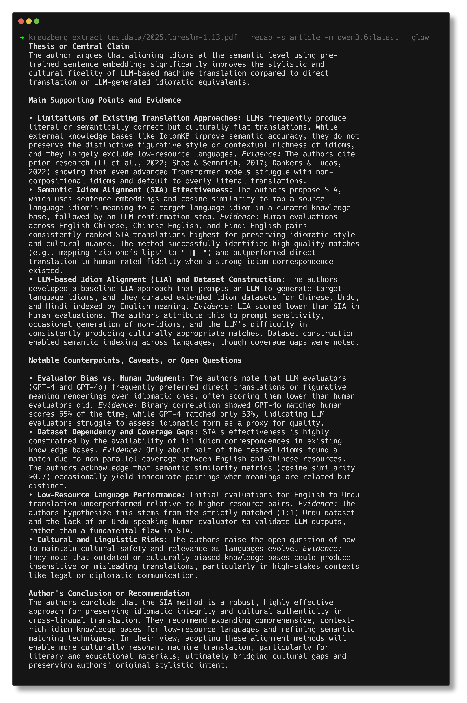
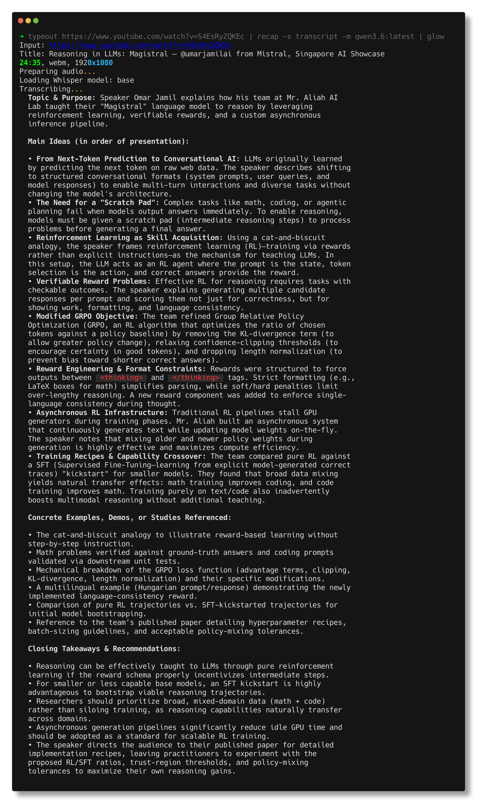

# chibi

**A chibi-sized summary for any text.** Pipe text in, get a structured summary
out. This tool will only do the summarization. For turning your file into text
use other tools like
[pdftotext](https://www.xpdfreader.com/pdftotext-man.html),
[kreuzberg](https://github.com/kreuzberg-dev/kreuzberg),
[typeout](https://github.com/miku/typeout), ...

[](https://etc.usf.edu/clipart/24100/24118/cotton_compr_24118.htm)

## Installation

```
$ go install github.com/miku/chibi/cmd/chibi@latest
```

Or packaged as [deb or rpm](https://github.com/miku/chibi/releases).

## LLM selection

If no explicit LLM endpoint and model are given, **chibi** will try to [discover](https://github.com/miku/chibi/blob/main/internal/discover/discover.go)
a suitable endpoint and model by looking for typical environment variables,
like `OPENAI_BASE_URL` or `OLLAMA_HOST`, but you can also set endpoint `-e`
and model `-m` explicitly.

To show the discovered endpoint and model:

```
$ chibi -i
endpoint: http://chiba:11434/v1
model:    nemotron-3-nano:30b-a3b-fp16
styles:   article, basic, paper, paperplus, podcast, transcript
cache:    /home/tir/.cache/chibi

```

## Your PDF, YouTube video transcriptions and any other text as input

```
$ kreuzberg extract testdata/2025.loreslm-1.13.pdf | \
    chibi -s article -m qwen3.6:latest | glow

$ typeout https://www.youtube.com/watch?v=S4EsRyZQKEc | \
    chibi -s transcript -m qwen3.6:latest | glow
```

See some example rendering/screenshot below.

## Usage examples

```shell
# Default summary using the autodiscovered model
$ cat article.md | chibi

# Pick a style tailored to the input type
$ chibi -s transcript < lecture.vtt
$ chibi -s podcast    < interview.txt
$ chibi -s paper      < paper.txt

# Like paper, but weaves in short verbatim quotes from the source
$ chibi -s paperplus  < paper.txt

# Show resolved endpoint, model, styles, cache dir (no LLM call)
$ chibi -i

# Force a fresh variant (LLMs are probabilistic; -f grows the cache)
$ chibi -f < input.txt

# Render every cached variant for an input as one markdown document
$ chibi -A < input.txt | glow -p -

# Use a specific model on a remote endpoint
$ chibi -e https://api.example.com/v1 -k "$TOKEN" -m gpt-4o < article.txt
```


## More Impressions

Using various tools to turn files into plain text.




